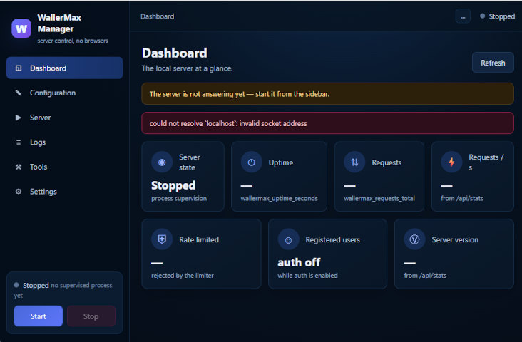

# wallermax-manager
[](https://www.rust-lang.org) [](https://github.com/tokio-rs/axum) [](LICENSE) [](#roadmap)
<div align="left">
<p></p>
</div>

A cross-platform **desktop** application to manage a `wallermax-server`:
its two configuration files, its process, its logs and its local
endpoints — in a native window, never in a browser.

> **Scope**: servers, not websites. The manager deliberately does
> **not** touch web content, tenants or user accounts — the server's own
> panel already does that. The prototype's *Websites* section is
> intentionally absent.

## Layout

```
manager/
├── crates/wallermax-manager-core/   the headless core (all the logic,
│                                     32 unit tests, no GUI)
├── src-tauri/                        the Tauri shell (thin commands)
└── ui/                               the dark UI (vanilla HTML/CSS/JS)
```

The core depends on the server itself (`path = "../../.."`) and validates
every configuration edit through `AppConfig::load_from_toml_layers` —
the server's real parsing pipeline. The editor can never accept a file
the server would reject, nor reject one it would accept. The shell is a
handful of one-line delegations, so everything that matters is logic
that already ran green on Linux and Windows alike.

The workspace has **its own lockfile**: building the manager never
perturbs the server's dependency graph.

## Requirements

- Rust 1.88+ (`rustup`).
- The Tauri v2 CLI: `cargo install tauri-cli --locked` once.
- Platform WebView, which Tauri uses the system's own:
  - **Windows** — nothing extra (Edge WebView2 is built into Windows 10/11).
  - **Linux** — `libwebkit2gtk-4.1-dev`, `build-essential`, `libssl-dev`
    (plus `librsvg2` only for `tauri build` bundles).
  - **macOS** — Xcode command-line tools.

## Running and building

```sh
cd manager/src-tauri
cargo tauri dev      # the development window
cargo tauri build    # installers / binaries under src-tauri/target
```

The core alone (no GUI needed):

```sh
cd manager/crates/wallermax-manager-core
cargo test           # 32 tests: spawn/stop, boot probe, logs cursor,
                    # layered TOML validation, backups, settings, metrics
cargo clippy --all-targets -- -D warnings
```

## First run

1. Open **Settings** and point **Server command** at the real binary
   (e.g. `C:\wallermax\target\release\wallermax-server.exe`). Point at
   the binary itself, not at `cargo run` — the manager supervises its
   own child, and it can only stop what it parented.
2. Set **Configuration directory** if the manager did not find
   `wallermax.toml` on its own (it searches upward from its working
   directory).
3. Check **Origin** matches `[server] host:port` — health, metrics and
   stats are all derived from it.
4. **Server → Start**. The boot probe watches the first seconds: a
   refusal shows the captured output as the reason; the server's
   `wallermax-server listening` line confirms a healthy boot instantly.

## How process control behaves

- The server is spawned **directly** (no `cmd.exe`/`sh` wrapper): the
  tracked process is the server, its environment is inherited
  untouched, and on Windows the program resolves through `System32`
  even under a stripped `PATH`.
- Output is captured line-by-line into a sequence-numbered buffer;
  the Logs view polls with a cursor, so no duplicates and no gaps.
- **Stop is tree-level** — the server's helpers (template sidecar)
  die with it:
  - Unix: SIGTERM to the child's process group, escalating to SIGKILL
    after the grace period.
  - Windows: one captured, windowless `taskkill /PID <pid> /T /F`
    (console children cannot be closed gracefully; the server's storage
    is crash-safe by design).
- Closing the manager leaves a running server alive (orphaned but
    healthy); start it again from the manager afterwards.

## Roadmap

- Membership and content views belong to the server's own panel; the
  manager may later grow a Build section (`cargo build --release`) and
  certificate helpers — the core is designed to take them as new
  modules behind the same facade.
